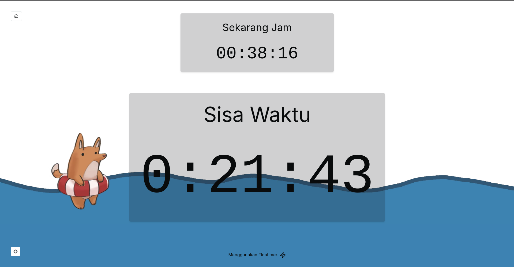
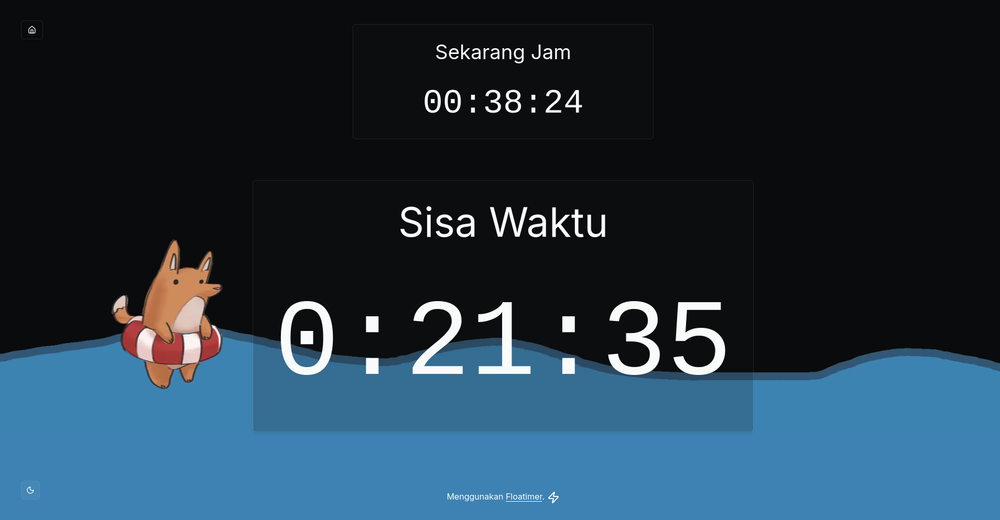
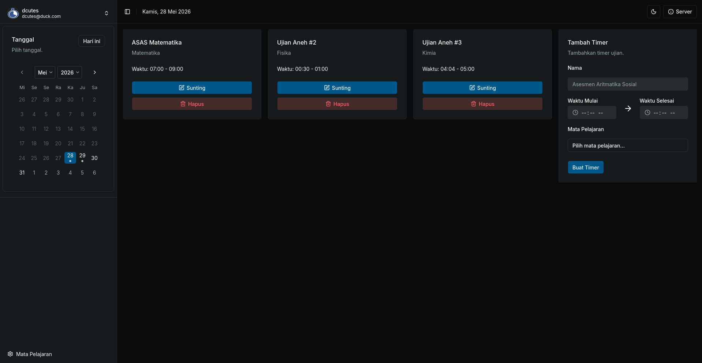
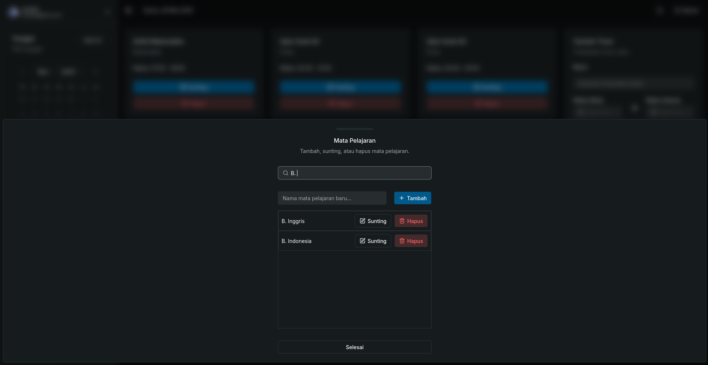
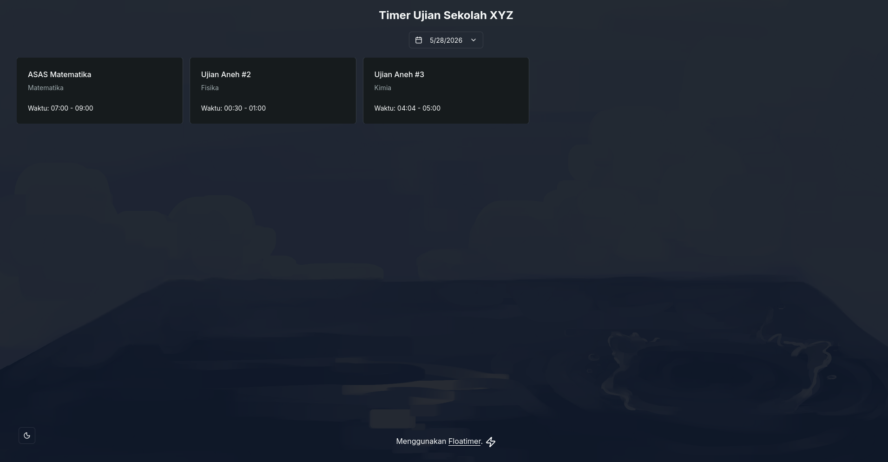

# Floatimer
Aplikasi timer ujian untuk _smart board_ (atau perangkat lain) paling keren yang selalu kamu inginkan. Hadir dengan tema gelap, dashboard admin, tampilan responsif, dan visualisasi lucu.

Aplikasi ini merupakan aplikasi web yang ditulis dengan [SvelteKit](https://svelte.dev/docs/kit). Beberapa library yang digunakan di antaranya:
- [better-auth](https://better-auth.com/)
- [shadcn-svelte](https://www.shadcn-svelte.com/)
- [Drizzle ORM](https://orm.drizzle.team/)

## Fitur
- Admin dashboard untuk mengelola semua timer.
- Tema gelap.
- Tampilan responsif.
- Visualisasi timer yang menarik.
- Sinkronisasi informasi timer dengan server (setiap beberapa waktu), timer yang sedang berjalan dapat langsung diperbarui.
- Penggunaan waktu server: waktu selalu dalam zona waktu server dan tidak dipengaruhi waktu pada perangkat.

## Screenshot

### Timer
Visualisasi unik: air yang perlahan naik akan semakin memenuhi layar sesuai progres timer.





### Dashboard Admin



### Halaman Beranda


## Latar Belakang
Kami menggunakan website [time.is](https://time.is/) sebagai timer ujian, tetapi situs tersebut hanya menunjukkan waktu dan tidak menunjukkan durasi waktu yang tersisa. Selain itu, jadwal ujian yang berubah-ubah juga menyulitkan hidup kami (misalnya ketika seseorang lupa jadwal hari tersebut). Oleh karena itu, kami menulis aplikasi timer ini sehingga seluruh timer ujian dapat dibuat lebih awal dan langsung dibuka ketika hari ujian tiba.


## Instalasi & Panduan Penggunaan

### Deploy
Sesuaikan dengan adaptermu: [svelte.dev/docs/kit/adapters](https://svelte.dev/docs/kit/adapters).

### Membuat Akun
Tidak ada interface web khusus untuk membuat akun administrator, gunakan endpoint `/admin-api/create-user`. Misalnya (dengan cURL):

```sh
curl -X POST https://floatimer.my.page/admin-api/create-user -H 'x-api-key: xxxxxxxxxxxxxx' -H "Content-Type: application/json" -d '{"username": "myname", "email": "myname@mail.com", "password": "mypassword"}'
```


## Kredit
- Gambar dan rancangan UI: karya kami sendiri.
- Library: sesuai `package.json`.
- Penggunaan LLM: kebanyakan untuk debugging dan mencari dokumentasi agar hemat waktu, tidak untuk menulis kode langsung. Aman aja, aku tahu semua kode yang diketik dan alasannya. —[Daringcuteseal](https://github.com/Daringcuteseal)
